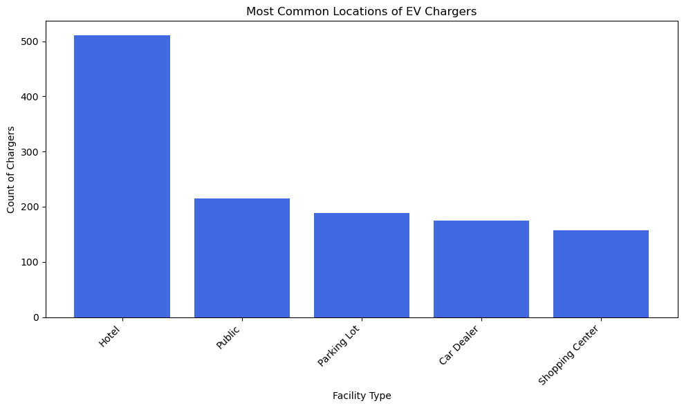
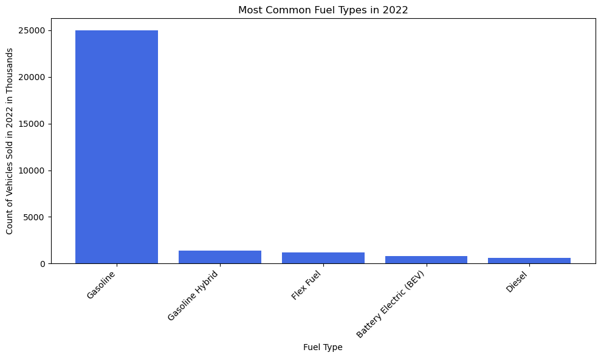
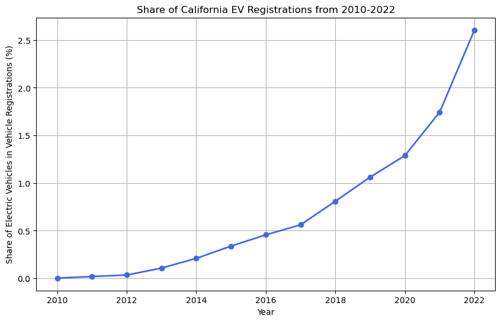
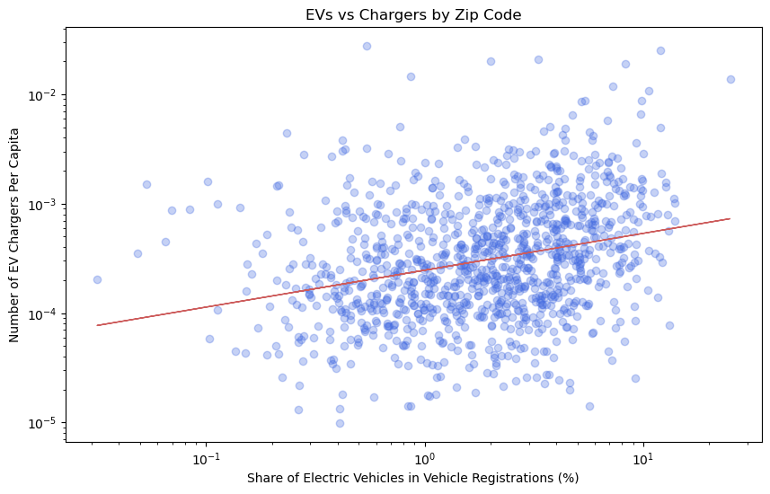
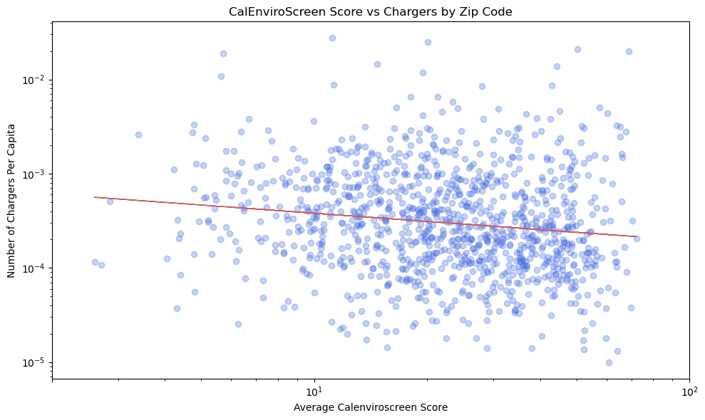
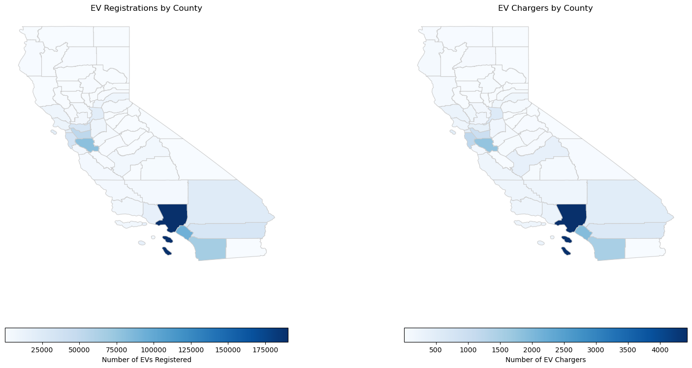
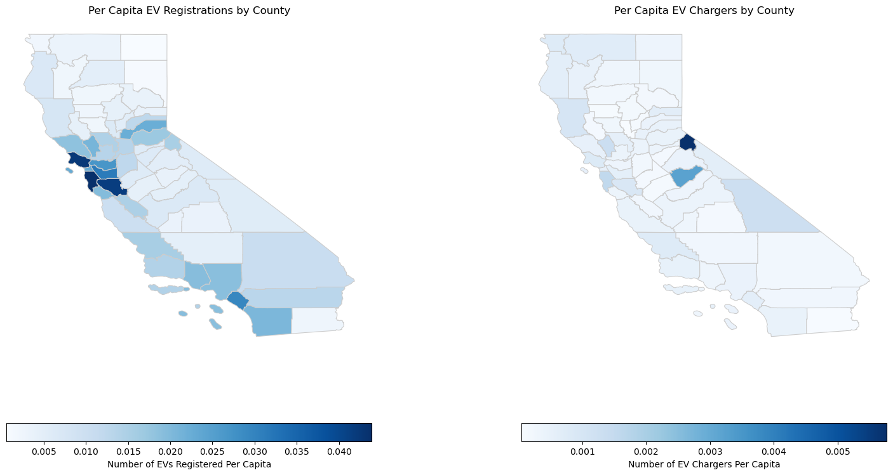
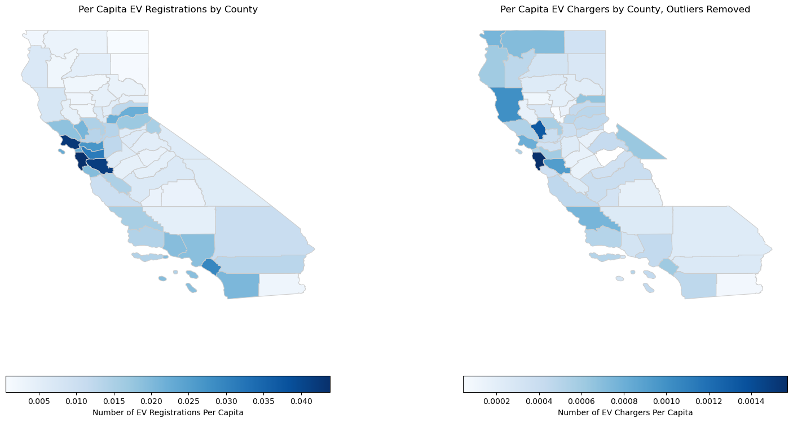

# EV Adoption in California
## Kerina Patel and Dana Morgan

### Introduction
For our final project, we wanted to explore electric vehicle (EV) adoption in California. We wanted to understand which regions in California were hotspots for EV adoption and wondered whether areas with more EV charging infrastructure would have higher rates of EV adoption. 

### Data Sources
Data on the EV chargers and registrations came from the California Energy Commission. EV charger data was last updated March 2024 and EV registration data was last updated December 31, 2022. The data on EV chargers was accessed via API and included information on the location and type of charger. Data on EV registration was available as an Excel file download and included the number of cars registered from 2010 to 2022 on both a county and zip code level. This data source provided the number of vehicles registered by each fuel type. The datasets contained 17,229 charging stations and over 29 million vehicles registered in 2022. We also used data from CalEnviroScreen to calculate county-level populations and zip code-level disadvantaged community scores. 

### Methodology
To contain the scope of the project, we focused our exploration on the adoption of electric vehicles and electric vehicle charging stations in the state of California. After compiling the datasets needed to explore our topic, we cleaned the data by removing unnecessary columns, creating a version of the vehicle data that included only fully electric vehicles, and filtering the charging station data to include only publicly available facilities. We also created a version of the car registration data that was filtered to include only vehicles registered in 2022 and a version that had the percentage of cars in each year that were EVs. The following findings and visualizations were produced in a Jupyter Notebook script using Python.

### Exploratory Analysis
We began our research by conducting exploratory analysis to get familiar with the data. Our exploratory analysis aimed to add context to the fuel types of vehicles registered in California and which types of facilities host the most EV chargers. We also aimed to provide context on the relevance of this project by visualizing the increase in the registration of EVs over time. 

We looked at the types of EV chargers most common throughout the state to understand where these chargers were most likely to be located. We saw that hotels made up a large portion of publicly available EV chargers and were the most common facility type. 

We also looked at the fuel types of the vehicles registered in California in 2022 and saw that a large majority were gasoline-powered. Electric vehicles were less common than hybrid vehicles but more common than diesel vehicles. To make the y-axis more readable, we put the count of vehicles in each category in thousands. 

We then calculated the total number of EVs registered in each year that we had data for, 2010 through 2022. We turned the number of EVs into a percentage of all vehicles registered in that year. In looking at the number of EVs in the state of California, we saw a sharp increase in the adoption of EVs in the past decade. This increase in the percentage of EVs matched what we expected based on technological advances, increasing affordability of EVs, and policy changes encouraging electrification. 

### Key Findings
#### Part 1
In Part 1 of our key findings section, we aim to understand the relationships between our variables of interest by producing scatterplots, regression lines, and R-values. To explore the relationships between EVs and EV chargers, we grouped each variable by zip code, plotted each zip code on a scatterplot, and calculated a regression line to illustrate the relationship. For both of the scatterplots below, we plotted the data on a logarithmic scale to better visualize the spread of data. 

This chart plots the number of chargers per capita by the percentage of EVs registered in each zip code in California. The correlation coefficient, or R-value, is 0.2303. The plotted regression line and calculated R-value show that there is a slight positive correlation. Though we cannot determine statistical significance from this analysis, this slight positive correlation suggests that zip codes with a larger share of EVs registered in 2022 have more EV chargers per capita. 

Without a significance test evaluating statistical significance, we cannot determine if increasing the number of chargers would result in an increase in EV registrations or if increasing the number of EVs would motivate expanded EV charging infrastructure. Establishing this causality is a more challenging topic that future research could address. 

    

The chart below plots the per capita number of EV chargers by the average CalEnviroScreen score for each zip code in California. A zip code's CalEnviroScreen score is calculated using a series of indicators reflecting social, economic, and environmental disadvantages. The overall score represents an average level of disadvantage in that zip code, with higher scores indicating higher levels of disadvantage and worse conditions. The correlation coefficient, or R-value, is -0.0123. The plotted regression line and this calculated R-value show that there is a slight negative correlation between the per capita number of EV chargers and the average CalEnviroScreen score. This slight negative correlation may suggest that a zip code with a higher CalEnviroScreen score would be expected to have fewer EV chargers per capita. Because EV charging infrastructure has historically been inequitably distributed and concentrated in high-income neighborhoods, we expected to see a stronger negative correlation between the number of EV chargers and the level of disadvantage in a community (Khan 2022). However, the calculated correlation coefficient is relatively small, reflecting a less strong correlation between the variables. Further analysis of the spatial correlation between EV chargers and a community's social, economic, and environmental characteristics could help investigate whether there is indeed a relationship between the number of EV chargers and a zip code's level of disadvantage. 

As stated above, because we did not conduct a significance test, we cannot claim this relationship to be statistically significant. Again, establishing causality in this relationship is a topic that future research could address. 

  
#### Part 2
In the second part of our key findings, we attempt to identify hotspots of EV adoption in California by producing a series of choropleth maps. We conducted county-level spatial analysis to find relative hotspots of EV adoption in both raw numbers and in density per capita. For this analysis, the EV registration data was merged by County ID with the county geometry and summed to reflect the total number of EVs registered in 2022 within each county. The EV charger data did not have county IDs, but each charger had data on its latitude and longitude coordinates. We assigned each charger to a county through geolocation and a spatial join with the county geometry. For both EV charger and registration data, we normalized the data by population estimates from the CalEnviroScreen dataset, dividing the number of EVs and EV chargers by the number of people in each county. Finally, using GeoPandas and MatPlotlib, we produced choropleth maps that show which counties within the state have more EVs and more EV charging infrastructure.

This first set of maps shows the density of EVs and EV chargers by county in California. It would appear that Los Angeles County is the hotspot of EV adoption in the state when looking at a basic count of registrations and chargers in the county. These maps are very similar to each other, suggesting that counties with more EVs are also those counties with more EV charging infrastructure. This follows from our findings in the first scatterplot above, that there is a positive correlation between the number of EV chargers and the number of EVs registered in a community.

However, we were suspicious that a simple count was not a complete enough representation of EV adoption, as Los Angeles County is the county with the highest population in the state. To account for variations in population density by county, we took the number of EVs and chargers in the county and divided it by the total county population. 

When we took into account the population of each county, we found that the Bay Area emerged as the hotspot of EV registrations. However, the map of EV chargers took us by surprise, as Alpine County seemed to have a much higher concentration of chargers than any other county in the state. Upon looking into Alpine County, we found that this county is near Lake Tahoe and is home to many ski resorts and relatively few permanent residents, resulting in an overinflated per capita number of EV chargers. Given our exploratory analysis graph that highlighted hotels being the leading place where EV chargers were located, we believe this outlier to be a result of Alpine County having many ski resorts with EV chargers.

In addition the Alpine County outlier described above, Mariposa County and Inyo County also saw abnormally high densities of EV chargers. Like Alpine County, both Mariposa and Inyo Counties are in the Sierra Nevada mountain ranges and are home to large ski and tourist economies with few permanent residents. To better visualize the differences in EV charger densities across the state, we created a map excluding these three outliers. The gaps in the map below are where those three outlier counties were removed. Without these counties, the map shows greater variation throughout the state, and similarly to the EV registration map, shows a hotspot of EV chargers in the Bay Area. Once again, we see that the places with the most EV chargers are also those with the most EV registrations. 

### Limitations
While these findings paint a general picture of regional hotspots for EV adoption in California, we faced limitations that may affect the generalizability of the findings. First, the CalEnviroScreen data, while complete on the county level, left about 30% of zip codes in California without a disadvantaged community score. These zip codes could not be included in our scatterplot visualization of EV chargers by CalEnviroScreen score. Additionally, the EV charging station data contained many incomplete addresses which were dropped from the analysis as they could not be geolocated. Lastly, as discussed in Part 1 of the Key Findings section, we are unable to establish causality or statistical significance at this stage of analysis, but further research could attempt to do so. 

### Sources
1. California Energy Commission (2023). California Energy Commission Zero Emission Vehicle and Infrastructure Statistics. Data last updated December 31, 2022. Retrieved April 27, 2024 from http://www.energy.ca.gov/zevstats.
2. California Office of Environmental Health Hazard Assessment (2024). CalEnviroScreen 4.0. Data last updated May 1, 2023. Retrieved April 3, 2024 from https://oehha.ca.gov/calenviroscreen/report/calenviroscreen-40.
3. California Open Data Portal (2024). CA Geographic Boundaries. Data last updated January 1, 2023. Retrieved April 12, 2024 from https://data.ca.gov/dataset/ca-geographic-boundaries.
4. Khan, Hafiz Anwar Ullah, Sara Price, Charalampos Avraam, and Yury Dvorkin. 2022. “Inequitable Access to EV Charging Infrastructure.” The Electricity Journal 35 (3): 107096. https://doi.org/10.1016/j.tej.2022.107096.
5. National Renewable Energy Laboratory (2024). Alternative Fuel Stations. Data last updated March 2024. Retrieved April 21, 2024 from https://developer.nrel.gov/docs/transportation/alt-fuel-stations-v1/.
