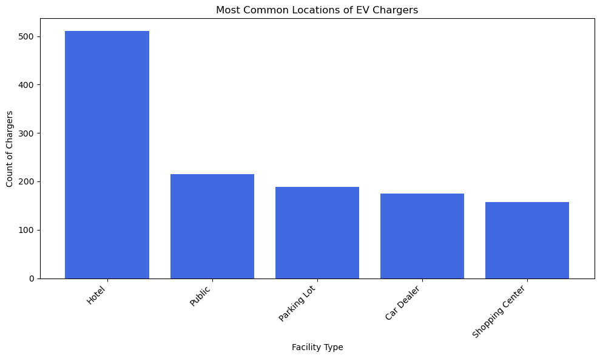
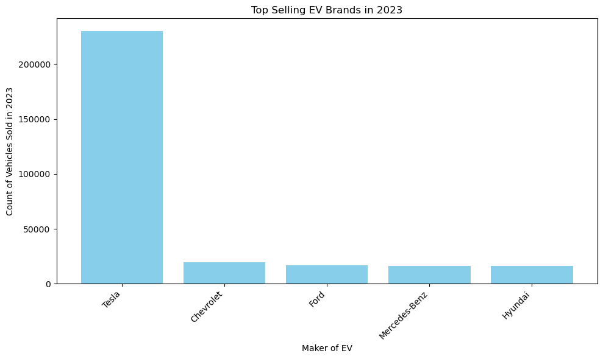
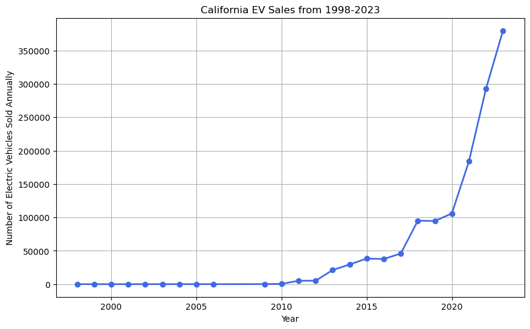
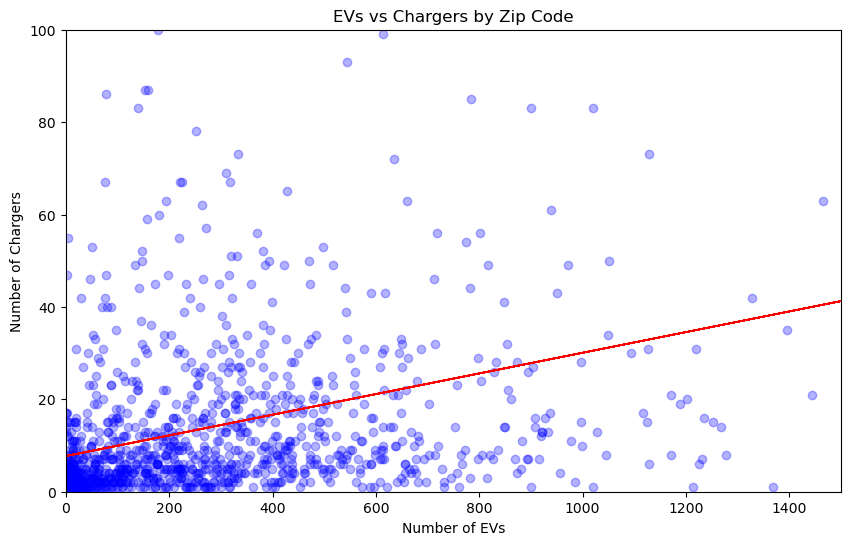
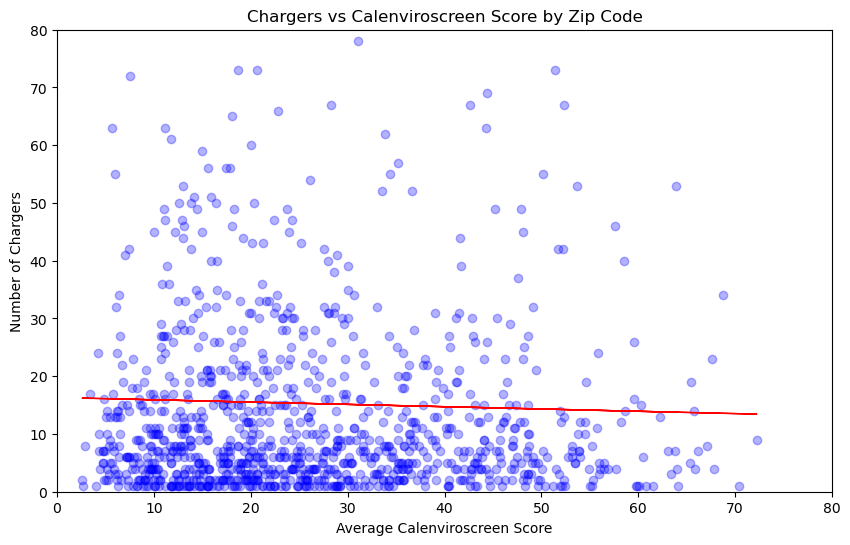
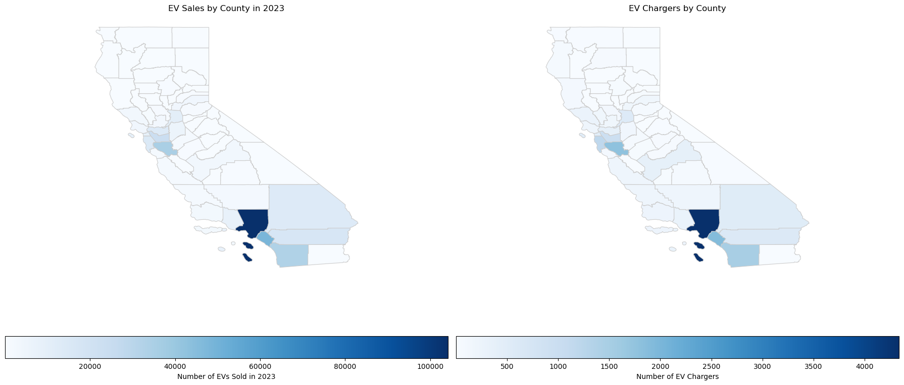
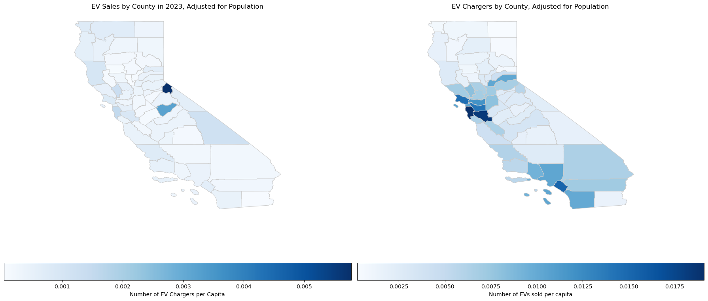

# EV Chargers and Sales in California
## Kerina Patel and Dana Morgan

### Introduction
For our final project, we wanted to explore electric vehicle (EV) adoption in California. We wanted to understand which regions in California were hotspots for EV adoption, and wondered whether areas with more EV charging infrastructure would have higher rates of EV adoption. 

### Data Sources
Data on the EV chargers and sales came from the California Energy Commission. EV charger data was last updated March 2024 and EV sales data was last updated December 31, 2023. The data on EV chargers was accessed via API and included information on the location and type of charger. Data on EV sales was available as a csv file download and included the number of each make and model of all zero emission vehicles (which included hydrogen, electric, and hybrid powered vehicles) sold from 1998 to 2023 on both a county and zip code level. The datasets contained 17,229 charging stations and 379,727 electric vehicles sold in 2023. 

We also used data from CalEnviroScreen to calculate county level populations and zip code level disadvantaged community scores. 

### Methodology
To contain the scope of the project, we focus our exploration only on the adoption of electric vehicles and electric vehicle charging stations in the state of California. Upon compiling the datasets needed to explore the subject, we first cleaned the data by removing unnecessary columns, filtering both the vehicle and charging station data to include only fully electric vehicles, and filtering the charging station data to include only publicly available facilities. For some of the analysis, the EV data was also filtered to include only sales recorded in 2023. The following findings and visualizations were produced in a Jupyter Notebook script using Python.

### Exploratory Analysis
We began our research by conducting exploratory analysis to get familiar with the data. Our exploratory analysis aimed to add context to which companies provide the most EVs and which types of facilities host the most EV chargers. We also aimed to provide context on the relevance of this project by visualizing the increase in EV sales over time. 

We looked at the types of EV chargers most common throughout the state to understand where these chargers were most likely to be located. We saw that hotels made up a large portion of publicly available EV chargers. 

We also looked at the types of EVs most frequently sold in California in 2023, and saw that Tesla's sales were notably higher than any other car brand. 

We then calculated the total number of EVs sold in each year that we had data for, 1998 through 2023. In looking at the number of EVs sold in the state of California, we saw a sharp increase in the adoption of EVs in the past decade. This follows based on technological advances, improving affordability of EVs, and policy changes encouraging electrification.

### Key Findings
#### Part 1
In Part 1 of our key findings section, we aim to understand the relationships between our variables of interest by producing scatterplots, regression lines, and R-values. To explore the relationships between EVs and EV chargers, we grouped each variable by zip code, plotted each zip code on a scatterplot, and calculated a regression line to illustrate the relationship. 

This chart plots the number of chargers by the number of EVs sold for each zip code in California. The correlation coefficient, or R-value, is 0.3548. The plotted regression line and calculated R-value show that there is a slight positive correlation. Though we cannot determine statistical significance from this analysis, this slight positive correlation suggests that zip codes with more EVs sold in 2023 have more EV chargers. 

Without a significance test evaluating statistical significance, we cannot determine if increasing the number of chargers would result in an increase in EV sales or if increasing EV sales would motivate expanded EV charging infrastructure. Establishing this causality is a more challenging topic that future research could address. 

    

The chart below plots the number of EV chargers by the average CalEnviroScreen score for each zip code in California. A zip code's CalEnviroScreen score  is calculated using a series of pollution and population disadvantage indicators and represents an average level of disadvantage in that zip code. The correlation coefficient, or R-value, is -0.0233. The plotted regression line and calculated R-value show that there is a slight negative correlation. This slight negative correlation may suggest that a zip code with a higher CalEnviroScreen score (reflecting a more disadvantaged community) would be expected to have fewer EV chargers. 

As stated above, because we did not conduct a significance test we cannot claim this relationship to be statistically significant. Again, establishing causality on this relationship is a topic that future research could address. 

  
#### Part 2
In the second part of our key findings, we attempt to identify hotspots of EV adoption in California by producing a series of chloropleth maps. We conducted county-level spatial analysis to find relative hotspots of EV adoption in both raw numbers and in density per capita. For this analysis, the EV data was merged by County ID with the county geometry, then summed to reflect the total number of EVs sold in 2023 within each county. Rather than county designations, the EV charging data was accompanied by latitude and longitude coordinates. Because of this, the charging data was assigned to a county through geolocation and a spatial join with the county geometry. For each variable, we normalized the data with population estimates from the CalEnviroScreen 4.0 dataset, dividing estimates of EVs and EV chargers by the number of people in each county. Finally, using GeoPandas and MatPlotlib, we were able to produce chloropleth maps that show which regions within the state have adopted more EVs and have more EV charging infrastructure.

This first set of maps shows the density of EV sales and EV chargers by county in California. It would appear that Los Angeles County is the hotspot of EV adoption in the state when looking at a basic count of sales and chargers in the county. These maps are very similar to each other, suggesting that counties with more EV sales are also those counties with more EV charging infrastructure. 

However, we were suspicious that a simple count was not a complete enough representation of EV adoption, as Los Angeles County is the county with the highest population in the state. To account for variations in population density by county, we took the number of EVs in the county and divided it by the total county population. 

When we took into account the population of each county, we found that the Bay Area emerged as the hotspot of EV sales. However, the map of EV chargers took us by surprise, as Alpine County seemed to have a much higher concentration of chargers than any other county in the state. Upon looking into Alpine County, we found that this county is close to Lake Tahoe and is home to many ski resorts and relatively few permanent residents, resulting in an overinflated per capita number of EV chargers. Given our exploratory analysis graph that highlighted hotels being the leading place where EV chargers were located, we believe this outlier to be a result of many ski resorts with EV chargers.

### Sources
1. California Energy Commission (2024). California Energy Commission Zero Emission Vehicle and Infrastructure Statistics. Data last updated December 31, 2023. Retrieved April 3, 2024 from http://www.energy.ca.gov/zevstats.
2. California Office of Environmental Health Hazard Assessment (2024). CalEnviroScreen 4.0. Data last updated May 1, 2023. Retreieved April 3, 2024 from https://oehha.ca.gov/calenviroscreen/report/calenviroscreen-40.
3. California Open Data Portal (2024). CA Geographic Boundaries. Data last updated January 1, 2023. Retreieved April 12, 2024 from https://data.ca.gov/dataset/ca-geographic-boundaries.
4. National Renewable Energy Laboratory (2024). Alternative Fuel Stations. Data last updated March 2024. Retrieved April 21, 2024 from https://developer.nrel.gov/docs/transportation/alt-fuel-stations-v1/.
